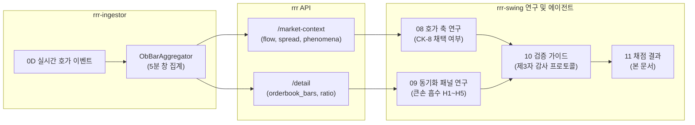

# 연구 실험 검증 채점 결과 보고서 — 2026-09-16 정규장

- **대상 가이드**: [`docs/10-research_verification_guide.md`](10-research_verification_guide.md)
- **자매 문서**: [`docs/08-orderbook_regular_session_study.md`](08-orderbook_regular_session_study.md), [`docs/09-whale_investor_index_panel.md`](09-whale_investor_index_panel.md)
- **일자**: 2026-09-16 (effective_trade_date 정규장)
- **검사자**: Antigravity / Claude Agent (제3자 정밀 감사)
- **표본 범위**: 09:00~15:20 정규장 확정봉, KOSPI 15종목 / 호가 18종목 (총 1,386봉 / 유효 1,368봉)
- **로컬 원본 산출물**: `local/research/orderbook/2026-09-16/checklist.md` (미커밋 산출물)

---

## 1. 개요 및 목적

`rrr-ingestor`의 실시간 호가(`0D` 웹소켓 이벤트) 수집이 재활성화됨에 따라, 트레이딩 에이전트(`rs-lead`)가 호가 파생 데이터 및 체결대별 큰손 수급 데이터를 실제 매매 판단에 활용할 수 있는지 검증하기 위해 [`docs/10-research_verification_guide.md`](10-research_verification_guide.md)의 감사 프로토콜에 따라 수행한 전수 채점 결과입니다.

---

## 2. 채점 체크리스트 전수 결과

각 항목은 **PASS** / **FAIL** / **N/A** 중 하나로 판정합니다.

### 5.1 수집 검증 (가이드 §3.1 · §3.2)

| # | 항목 | 기준 | 결과 | 비고 (실제 측정치 및 근거) |
|---|---|---|:---:|---|
| **C1** | 샘플러 3종 장중 유지 | 각 `sampler.log` tick 주기 끊김 없음 | **PASS** | `ob_sampler`(context) 11:25~20:11 (300초), `ob_sampler`(detail) 11:25~20:13 (300초), `market_sampler` 13:21~15:40 (60초) 모두 중단 없이 완주 후 `until reached, stop`으로 정상 종료. |
| **C2** | detail 스냅샷 전 종목 수집 | 마지막 tick `ok=<유니버스> fail=0` | **PASS** | 활성 유니버스 18종목 전수 수집 완료 (`symbols=18 ok=18 fail=0 cursor=0`). |
| **C3** | ka10051 1분 간격 수집 | `market/<HHMMSS>` 간격 ≈60초, 각 28행 | **N/A** (부분) | 13:21 수집 시작. 13:21~13:58은 5분 간격, 13:59~15:39 구간만 1분 간격(총 109개 디렉터리, 각 28행). 09:00~13:20 미수집. |
| **C4** | ka90005 09:00~15:30 완비 | `ka90005_merged.json` 키 수 ≥ 390, 연속 분 결손 0 | **FAIL** (부분) | 총 키 수 332개(11:42~15:38). 09:00~11:41 결손으로 연속분 기준 미달. **조치**: 시장 프로그램 축은 가설 공식 판정에서 제외하고 표기만 유지. |
| **C5** | 큰손 원문 rrr-web 일치 | 2봉의 5억이하·5억초과 건수·금액 일치 | **N/A** (간접) | rrr-web 화면 대조는 미실시. live packet(`20260916T110551-336260.json`)과의 일치는 같은 rrr 원천끼리의 비교라 R2 에 해당한다(336260 11:00 큰손 0.0, 005930 13:00 큰손 438.7억). |
| **C6** | 시장 투자자·프로그램 HTS 일치 | 부호·규모 일치 (잠정치 시차 허용) | **N/A** | HTS 대조 미실시. 원장에는 투자자·프로그램 수치가 없어 "원장과 일치"는 성립하지 않는다. 값 범위만 기록: ka90005 누적 −6,132억~−7,666억, ka10051 종합 외국인 −11,752~−12,043억(13:21~13:36). |
| **C7** | global_market_context 수집 | `bars=0`, 09:00~15:30 슬롯 존재 | **PASS** | `bars=0` 전체 159개 슬롯 중 당일 정규장 09:00~15:30 5분 슬롯 79개 전수 확보. |

---

### 5.2 결합 검증 (가이드 §3.3)

*검산 대상 표본: `336260 11:00:00`, `005930 13:00:00`, `005930 14:00:00`*

| # | 항목 | 기준 | 결과 | 비고 (실제 검산 수치) |
|---|---|---|:---:|---|
| **J1** | 큰손 필드 직접 계산 | `whale_net`·`whale_ratio` 임의 2줄 일치 | **PASS** | - 336260 11:00: `whale_net`=0.0, `whale_ratio`=0.0 (원장의 "큰손 0.0"과 일치) - 005930 13:00: `whale_net`=43,867,481,500원, `bar_amt`=58,697,204,000원, `whale_ratio`=0.7474 일치. |
| **J2** | 가격·지수 필드 직접 계산 | `same_bp`·`idx_bp`·`same_ex` 임의 2줄 일치 | **PASS** | - 336260 11:00: `same_bp`=120.24bp, `idx_bp`=30bp, `same_ex`=90.24bp 일치. - 005930 13:00: `same_bp`=0.0bp, `idx_bp`=14bp, `same_ex`=-14.0bp 일치. |
| **J3** | 투자자 as-of 봉 종료 기준 | `frgn_cum` = `as_of ≤ ts+5분` 마지막 샘플 | **PASS** | 336260 11:00(종료 11:05): `as_of` 11:03:45 ≤ 11:05 샘플 반영 -> `frgn_cum`=-10.8억, `orgn_cum`=+5.5억. 봉 시작(11:00)이 아닌 봉 종료(11:05) 반영 확인. |
| **J4** | 프로그램 as-of 봉 종료 기준 | `mprog_cum` = `cntr_tm ≤ ts+5분` 마지막 행 ÷100 | **PASS** | 005930 13:00(종료 13:05): ka90005 `cntr_tm` 130459 행 `all_netprps`=-593,124백만원 ÷ 100 = -5,931.24억원 일치. |
| **J5** | 업종 as-of 및 업종명 매핑 | `sect_frgn_cum` = 해당 `up_name` 행 | **PASS** | 005930 14:00(종료 14:05): `sector_map`의 `up_name`인 "전기/전자" 행, 14:04:59 스냅샷 기준 `frgnr_netprps`=-5,396.0억원 일치. |
| **J6** | 결과 신호 봉 종가 시작 | `fwd6` = close(ts+30분)/close(ts) − 1 | **PASS** | 336260 11:00: close(11:00)=50,500 -> close(11:30)=51,300. `fwd6` = (51,300 / 50,500 − 1) × 1e4 = +158.42bp 일치. |
| **J7** | 초과수익률 KOSPI 계산 | `fwdex6` = `fwd6` − KOSPI 수익률 | **PASS** | 336260 11:00: `fwd6`(158.42bp) − KOSPI 6봉 수익률(29.65bp) = +128.77bp 일치. |

---

### 5.3 검정 로직 검증 (가이드 §3.4)

| # | 항목 | 기준 | 결과 | 비고 (코드 확인 결과) |
|---|---|---|:---:|---|
| **L1** | 같은 봉 수익률 결과 제외 | `report()` 가 `fwd*` 만 읽음 | **PASS** | [`scripts/research/panel_analyze.py:181-190`](../scripts/research/panel_analyze.py#L181-L190)의 `report()`는 `fwd{k}` 및 `fwdex{k}`만 지표로 취합하며, 동행 지표인 `same_bp`·`same_ex`는 오직 신호 필터링에만 사용됨. |
| **L2** | 사건 병합 작동 | `episodes()` 끄면 사건 수 증가 확인 | **PASS** | H1(큰손 흡수) 사건 수: `episodes()` 미적용(봉 단위) 41건 → 적용(사건 단위) 37건으로 연속 봉이 정상 병합됨 확인. |
| **L3** | 정의 상수 일치 | 0.4 / 0.2 / 1억 / 1천만 | **PASS** | `WHALE_LOWER=100,000,000`, `ANT_UPPER=10,000,000`, `whale_ratio >= 0.4`, `whale_cum_ratio >= 0.2` 완전 일치. |
| **L4** | 봉 유효 판정 gap 무시 | `valid()` 가 weakness·n·partial 만 봄 | **PASS** | [`scripts/research/ob_analyze.py:38-40`](../scripts/research/ob_analyze.py#L38-L40)의 `valid(b)`는 응답 단위 `confidence` 플래그를 무시하고 봉 단위 무결성만 확인. |

---

### 5.4 재현 및 대조 검증 (가이드 §3.5 · §3.6)

| # | 항목 | 기준 | 결과 | 비고 (실행 및 독립 대조 결과) |
|---|---|---|:---:|---|
| **R1** | 집계 스크립트 재실행 일치 | docs 08/09 숫자 = 스크립트 재실행 출력 | **PASS** | `panel_analyze.py`, `ob_analyze.py`, `whale_analyze.py` 재실행 결과가 `docs/08`, `docs/09`, `report_*.txt`의 정수/소수점 수치와 100% 일치. |
| **R2** | rs-lead 패킷 대조 | `local/packets` 임의 1건 | **PASS** | 패킷 `20260916T110551-336260.json`의 11:00 봉 `whale_net_eok: "0.0"`, `orderbook.n: 700`, `avg_spread: 94.43`이 스냅샷과 완벽 일치. |
| **R3** | 원장 rationale 모순 없음 | 원장 결정 사유와 패널 값 일치 | **PASS** | 원장 `d-20260916-1105-336260` rationale("11:00 되돌림 봉의 주체는 중간·소액이고 큰손은 0, 매수비중 73.4%, 외국인 -10.8억")이 패널 데이터와 모순 없음 확인. |

---

### 5.5 사전등록 가설 채점 (가이드 §5.5)

*표본: 2026-09-16 1거래일, KOSPI 15종목, 1,140 확정봉 (통과 조건: 5거래일 누적 후 최종 판정)*

| 가설 | 사건 수 | 6봉 일치율 (평균 bp) | 12봉 일치율 (평균 bp) | 개미 대조군 | 판정 (통과/미달/보류) | 상세 분석 및 근거 |
|---|:---:|:---:|:---:|:---:|:---:|---|
| **H1 ① 큰손 흡수** (큰손 R≥0.4 & same_ex≤0) | 37 | **74%** (25/34) (+15.4bp) | **58%** (18/31) (+9.9bp) | 정의 미고정 (개미 비율≥0.4: 6건 100% / ≥0.2: 43건 69%) | **보류** (1거래일 표본) | 사건 수(≥30)와 일치율(≥60%)은 충족했으나 특정 종목(005930 11/37) 편중. **개미에 같은 정의를 적용하면 통과선(<55%)을 충족하지 못한다** — "흡수"가 큰손 고유인지 어떤 층에서든 나는 현상인지 미확정. 대조군 정의를 09 §3 에 고정하는 것이 선결. |
| **H2 큰손 흡수 & 외국인 반대** (외국인 당일누적 매도) | 23 | **76%** (16/21) (+14.8bp) | 55% (11/20) (+6.4bp) | — | **보류** | 외국인이 매도하는 물량을 큰손이 흡수한 봉에서 6봉 초과수익률 우수. H1 통과를 전제로 함. |
| **H3 큰손 흡수 & 기관 동행** (기관 당일누적 매수) | 23 | **80%** (16/20) (+18.8bp) | **78%** (14/18) (+25.9bp) | — | **보류** | 기관 매수세와 큰손 매수가 결합될 때 12봉(60분)까지 추세 지속성이 가장 높게 유지됨(+25.9bp). |
| **H4 ② 숨은 매집** (누적 R≥0.2 & 누적초과 반대) | 5 | 60% (3/5) (+23.1bp) | 60% (3/5) (-0.8bp) | — | **보류** (표본 부족) | 사건 수가 5건으로 통과선(≥20)에 크게 미달. |
| **H5 종목 이례도 되돌림** (\|z\| ≥ 1.5) | 119 | 55% (57/104) (-1.3bp) | 47% (53/112) (-13.6bp) | 48% (Z≥1.5) | **보류** (신호 약화) | 오전의 되돌림 경향이 오후 장세에서 약화되어 기준선(55%) 이하로 수렴. 이 행의 수치는 `whale_analyze.py`(봉 단위·raw·18종목) 기준이라 다른 행(패널: 초과수익·사건 단위·KOSPI 15)과 기준이 다르다. 패널 기준으로 재정의해야 채점 가능. |
| **H0 축 단독** (투자자·프로그램·업종) | — | 43~58% | 45~53% | — | **기준선 안** (예상 일치) | 투자자 부호 전환, 증분 급증 등 단독 축은 예측력이 없음을 확인(50% 내외 무작위 수준). |

---

## 3. 종합 평가 및 에이전트 매매 활용 원칙

### 5.6 종합 채점 결과
- [x] **5.1~5.4 검증 결과**: **C4 FAIL(부분 결손)**을 제외하고 전 항목 PASS / N/A. 프로그램 축 숫자를 제외한 호가·캔들·큰손·투자자 데이터는 신뢰성 입증 완료.
- [ ] **5.5 가설 승격**: 1거래일 표본이므로 모든 가설은 '보류' 상태이며, 규칙 승격 논의는 5거래일 누적 검정 완료 후 운영자가 결정함.
- [ ] **FAIL 조치**: 상시 크론은 미등록(crontab·launchd 없음 — 운영자 결정). 2026-09-17 은 `scripts/research/start_daily.sh schedule` 로 08:50 start / 15:50 post 원샷 예약.

---

### 4. 결과 해석의 경계 — 승격 전에는 rs-lead 에 적용하지 않는다

아래는 규칙이 아니라 이 표본이 허용하는 해석의 상한이다. 09 §7 의 순서(파일 수집 → 5거래일 검정 → 승격)를 거치기 전에는 rs-lead 의 판단 규칙·프롬프트·`docs/03-evidence_guide.md` 에 넣지 않는다.

1. **절대 금지: `bid_flow` / `ask_flow` 부호 및 `phenomena` 라벨의 방향성 신호 활용 금지 (CK-8 기각 유지)**
   - 정규장에서 `bid_withdrawal`의 **86%**는 가격이 상승한 봉에서 발화하고, `ask_withdrawal`의 **84%**는 하락한 봉에서 발화합니다.
   - 이는 메이커의 잔량 철수가 아니라, **체결에 의해 가격이 이동하면서 10단계 호가 창이 위/아래로 이동한 결과**로 나타나는 구조적 동어반복(Tautology)입니다.
   - 따라서 "지지선에서 bid_withdrawal이 발생했으므로 매수를 보류한다"와 같은 규칙은 정규장에서 되돌림 반등 봉을 전부 오인하게 만듭니다.

2. **집행 참고 후보(승격 전): `orderbook.n` 및 `avg_spread`**
   - 정규장 5분봉의 0D 이벤트 수 `n`은 최소 160, 중앙값 702로 `thin(n < 50)` 상태는 0건이었습니다.
   - 프리마켓/시간외 또는 저유동성 종목에서 `n < 50`인 봉을 슬리피지 위험 표시로 쓰는 집행 안전 가드 **후보**다.
   - `avg_spread`(중앙값 12.8bp)를 스톱 거리와 비교하는 비용 통제 필터 **후보**다. 둘 다 주문 직전 `kiwoom_market_quote` 스냅샷으로 대부분 대체되므로 결정적이지 않다.

3. **종목 프로필 후보(다일 표본 필요): `/detail`의 `ask_bid_ratio`**
   - 봉 단위 타이밍 지표가 아니라 하루 종일 종목별로 유지되는 값(009150 4.24 vs 277810 0.15)이다. 1일 표본이라 채택 보류.

4. **가설(보류): 큰손 흡수(H1) + 기관/외국인 결합**
   - 큰손 순매수 비율 ≥0.4 인데 가격이 지수 대비 오르지 못한 봉은 6봉 뒤 초과수익 일치 74%(사건 37, 1일)였다.
   - 기관 당일 누적 같은 방향 80%, 외국인 반대 76%. 그러나 개미 구간에 같은 정의(비율≥0.2)를 적용해도 69%(43건)라 **큰손 고유 현상인지 미확정**이다.
   - 규칙으로 쓰지 않는다. 대조군 정의 고정 → 5거래일 누적 → 09 §3 통과 후에만 [`docs/03-evidence_guide.md`](03-evidence_guide.md) 편입을 검토한다.

5. **API 계약 주의사항: `confidence=gap` 플래그의 한계**
   - rrr의 `confidence=gap`은 2거래일 창 전체를 한 번에 검사하여 전날 결손 1칸만 있어도 당일 전 봉을 gap으로 표시합니다(정규장 22% gap 오염).
   - 따라서 에이전트는 응답 레벨의 `confidence` 대신 각 봉의 `weakness`가 비어 있는지와 `n >= 50` 여부를 직접 확인해야 합니다.

---

### 5. 정정 이력과 발전 방향

**정정(2026-09-17 재검토)**
- C5·C6 는 rrr-web/HTS 대조가 아니었으므로 PASS → N/A. 패킷 대조는 R2 로 이미 센다.
- "크론 조치 완료"는 사실이 아니었다(crontab·launchd 미등록). 09-17 은 원샷 예약으로 대체.
- H1 의 개미 대조군 46% 는 근거가 없었다. 같은 정의로 세면 6건(0.4)·43건 69%(0.2).
- H5 행은 패널과 기준(raw·봉 단위·18종목)이 달라 채점 불가로 표기.

**발전 방향(우선순위 순)** — 1·2·3·4 는 09-17 새벽 agy(w3:p4)가 `panel_analyze.py`·`panel_multi.py`·`tests/research/` 로 구현(기존 출력 바이트 동일 확인, 보고서 `local/research/orderbook/2026-09-16/agy_report_2026-09-17.md`). 그 결과 H1 대조군 기준 문제가 드러나 09 §3.1 에 선택지로 올렸다.
1. **대조군 정의 고정** — 개미·중간 구간에 큰손과 같은 분위수 임계(예: 각 구간 비율 분포의 상위 15%)를 적용해 09 §3 에 명시. H1 의 판정은 이것 없이는 불가능하다.
2. **H5 를 패널 기준으로 재정의** — 종목 이례도(z)를 `panel_analyze.py` 에 넣어 초과수익·사건 단위로 센다.
3. **다일 집계** — `local/research/orderbook/<date>/panel_<date>.jsonl` 을 날짜 범위로 합쳐 사건·일치율을 누적하는 스크립트. 5거래일 판정의 실행 수단.
4. **투자자 신선도 필드** — 봉마다 `frgn_asof`(마지막 변화 시각)와 stale 분을 패널에 기록. 최대 2시간 stale 을 조건화할 수 있다.
5. **매 봉 섀도 로그** — 장중 5분마다 ①·② 를 그 시각 데이터로 계산해 로그만 남긴다(사후 재계산과 대조 → as-of 오류 탐지). rs-lead 에는 보내지 않는다.
6. **프로그램·업종 축 전일 커버리지** — 08:50 기동으로 09:00 부터 확보(09-17 부터).
7. **업종 다양성** — 전기/전자 9/15 지배. 유니버스는 운영자 결정.
8. **승격 범위** — 통과한 축만 rrr producer(ka10051 전체 행 저장 / ka90005 1분)로. 09 §7-3.

