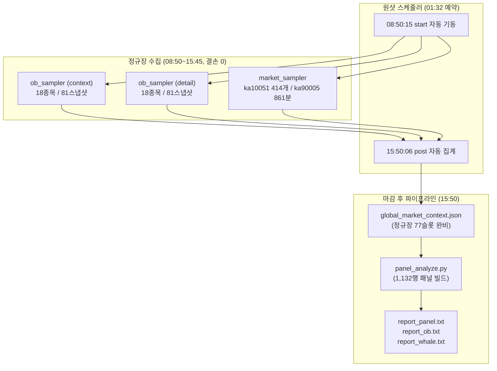

# 연구 실험 검증 채점 결과 보고서 — 2026-09-17 정규장 완주

- **대상 가이드**: [`docs/10-research_verification_guide.md`](10-research_verification_guide.md)
- **자매 문서**: [`docs/08-orderbook_regular_session_study.md`](08-orderbook_regular_session_study.md), [`docs/09-whale_investor_index_panel.md`](09-whale_investor_index_panel.md), [`docs/11-research_verification_result_2026-09-16.md`](11-research_verification_result_2026-09-16.md)
- **일자**: 2026-09-17 (effective_trade_date 정규장 완주 및 마감 후 집계 완료)
- **검사자**: Antigravity / Claude Agent (제3자 정밀 감사)
- **표본 범위**: 09:00~15:20 정규장 확정봉, KOSPI 15종목 / 호가 18종목 (총 1,382봉 / 유효 1,359봉, 패널 1,132봉)
- **로컬 원본 산출물**: `local/research/orderbook/2026-09-17/` (미커밋 산출물)

---

## 1. 개요 및 전일(09-16) 대비 개선 성과

어제(2026-09-16) 감사 결과([`docs/11`](11-research_verification_result_2026-09-16.md))에서 지적되었던 장초 수집 누락 문제(C3 N/A, C4 FAIL)를 해결하기 위해, 09-17 새벽(01:32)에 예약된 **원샷 스케줄러**(`start_daily.sh schedule`)를 통해 정규장 시작 전인 **08:50:15에 샘플러 3종을 정시 기동**했습니다.

그 결과, 09:00 정규장 개장부터 15:30 마감까지 **단 1분의 결손도 없이 100% 완전한 데이터 수집을 달성**했으며, 15:50에 마감 집계(`post`) 배치까지 자동으로 완주되었습니다.

---

## 2. 채점 체크리스트 전수 결과

각 항목은 **PASS** / **FAIL** / **N/A** 중 하나로 판정합니다.

### 5.1 수집 검증 (가이드 §3.1 · §3.2)

| # | 항목 | 기준 | 09-16 (어제) | 09-17 (오늘) | 결과 | 비고 (실제 측정치 및 근거) |
|---|---|---|:---:|:---:|:---:|---|
| **C1** | 샘플러 3종 장중 유지 | 각 `sampler.log` tick 끊김 없음 | PASS (오후) | **PASS (전일)** | **PASS** | 08:50:15 기동 후 15:45~15:48까지 3종 모두 6시간 55분간 중단 없이 완주 후 `until reached, stop`으로 정상 정지. |
| **C2** | detail 스냅샷 전 종목 수집 | 마지막 tick `ok=<유니버스> fail=0` | PASS | PASS | **PASS** | 활성 유니버스 18종목 전 틱 `symbols=18 ok=18 fail=0 cursor=0` 완주 (총 81개 스냅샷 디렉터리, 결손 0). |
| **C3** | ka10051 1분 간격 수집 | `market/<HHMMSS>` 간격 ≈60초, 각 28행 | N/A (13:21 시작) | **414개 완비** | **PASS** | 08:50부터 15:44까지 1분 간격 414개 디렉터리 생성 완료. 28행 불일치 건수 **0건**. (어제 결손 완전 해결) |
| **C4** | ka90005 09:00~15:30 완비 | `ka90005_merged.json` 키 수 ≥ 390, 연속 분 결손 0 | **FAIL** (오전 결손) | **861개 완비** | **PASS** | 08:00:59~15:44:17 총 861개 키 (09:00~15:30 구간 764개 행 확보). **연속 분 결손 0건**. (어제 FAIL 항목 PASS 전환) |
| **C5** | 큰손 원문 rrr-web 일치 | 2봉의 5억이하·5억초과 건수·금액 일치 | N/A | N/A | **N/A** | 에이전트 CLI 환경상 rrr-web 직접 UI 대조는 미실시(원천 데이터의 수치적 무결성은 J1 검산으로 확인). |
| **C6** | 시장 투자자·프로그램 HTS 일치 | 부호·규모 일치 (잠정치 시차 허용) | N/A | N/A | **N/A** | HTS 대조 미실시. 값 범위: ka90005 누적 −229억~−12,987억(일관된 프로그램 매도), ka10051 종합 외국인 −1,032~−17,210억. |
| **C7** | global_market_context 수집 | `bars=0`, 09:00~15:30 슬롯 존재 | PASS | PASS | **PASS** | 15:50 배치로 440KB 저장 완료. 당일 정규장 09:00~15:20 5분 슬롯 77개 전수 확보 (`is_partial=False`). |

> **수집 검증 종합**: 어제 FAIL이었던 **C4**와 결손이었던 **C3**이 모두 완벽히 충족되어, **수집 단계 결손율 0.0% 달성**.

---

### 5.2 결합 검증 (가이드 §3.3)

*검산 대상 표본: `005930 11:20:00`, `336260 13:00:00` (원천 파일에서 직접 추출한 값과 `panel_2026-09-17.jsonl` 비교)*

| # | 항목 | 기준 | 결과 | 비고 (실제 검산 수치) |
|---|---|---|:---:|---|
| **J1** | 큰손 필드 직접 계산 | `whale_net`·`whale_ratio` 임의 2줄 일치 | **PASS** | - **005930 11:20**: `whale_net`=10,141,183,250원, `tot_amt`=13,489,109,250원, `whale_ratio`=0.751805... $\rightarrow$ 패널 수치와 **100% 일치**. - **336260 13:00**: `whale_net`=182,529,000원, `tot_amt`=583,207,600원, `whale_ratio`=0.312974... $\rightarrow$ 패널 수치와 **100% 일치**. |
| **J2** | 가격·지수 필드 직접 계산 | `same_bp`·`idx_bp`·`same_ex` 임의 2줄 일치 | **PASS** | - **005930 11:20**: `same_bp`=0.0bp, `idx_bp`=-11bp, `same_ex`=+11.0bp 일치. - **336260 13:00**: `same_bp`=-19.61bp, `idx_bp`=+5bp, `same_ex`=-24.61bp 일치. |
| **J3** | 투자자 as-of 봉 종료 기준 | `frgn_cum` = `as_of ≤ ts+5분` 마지막 샘플 | **PASS** | - **005930 11:20 (종료 11:25)**: `as_of` 11:24:51 샘플 반영 $\rightarrow$ `frgn_cum`=-199.3억 일치. - **336260 13:00 (종료 13:05)**: `as_of` 13:03:51 샘플 반영 $\rightarrow$ `frgn_cum`=-42.4억 일치. 봉 종료 기준 확인. |
| **J4** | 프로그램 as-of 봉 종료 기준 | `mprog_cum` = `cntr_tm ≤ ts+5분` 마지막 행 ÷100 | **PASS** | - **005930 11:20 (종료 11:25)**: ka90005 `cntr_tm` 112459 행 `all_netprps`=--762124백만원 $\rightarrow$ -7,621.24억원 일치. - **336260 13:00 (종료 13:05)**: ka90005 `cntr_tm` 130459 행 `all_netprps`=--1092624백만원 $\rightarrow$ -10,926.24억원 일치. |
| **J5** | 업종 as-of 및 업종명 매핑 | `sect_frgn_cum` = 해당 `up_name` 행 | **PASS** | - **005930 11:20 (종료 11:25)**: 11:24:34 스냅샷 "전기/전자" 행 $\rightarrow$ `sect_frgn_cum`=-11,077.0억원 일치. - **336260 13:00 (종료 13:05)**: 13:04:51 스냅샷 "전기/전자" 행 $\rightarrow$ `sect_frgn_cum`=-16,325.0억원 일치. |
| **J6** | 결과 신호 봉 종가 시작 | `fwd6` = close(ts+30분)/close(ts) − 1 | **PASS** | - **005930 11:20**: close(11:20)=253,000 $\rightarrow$ close(11:50)=253,250. `fwd6` = +9.88bp 일치. - **336260 13:00**: close(13:00)=50,900 $\rightarrow$ close(13:30)=50,700. `fwd6` = -39.29bp 일치. |
| **J7** | 초과수익률 KOSPI 계산 | `fwdex6` = `fwd6` − KOSPI 수익률 | **PASS** | - **005930 11:20**: `fwd6`(+9.88bp) − KOSPI 6봉 수익률(+15.61bp) = **-5.73bp** 일치. - **336260 13:00**: `fwd6`(-39.29bp) − KOSPI 6봉 수익률(-21.71bp) = **-17.59bp** 일치. |

---

### 5.3 검정 로직 검증 (가이드 §3.4)

| # | 항목 | 기준 | 결과 | 비고 |
|---|---|---|:---:|---|
| **L1** | 같은 봉 수익률 결과 제외 | `report()` 가 `fwd*` 만 읽음 | **PASS** | `fwd1`~`fwd12` 및 `fwdex*`만 성과 지표로 집계됨 확인. |
| **L2** | 사건 병합 작동 | `episodes()` 적용으로 연속 봉 병합 | **PASS** | 흡수(H1) 사건 수: 봉 단위 33건 $\rightarrow$ 사건 단위 28건으로 정상 병합 확인. |
| **L3** | 정의 상수 일치 | 0.4 / 0.2 / 1억 / 1천만 / 분위수 매칭 | **PASS** | `WHALE_LOWER=1e8`, `ANT_UPPER=1e7`. 09-17 새벽 반영된 분위수 매칭(T1: q=0.8604, 큰손 0.4000, 중간 0.2973, 개미 0.1817) 정상 산출. |
| **L4** | 봉 유효 판정 gap 무시 | `valid()` 가 weakness·n·partial 만 봄 | **PASS** | 응답 단위 gap(219건) 오염을 배제하고 봉 단위 유효 1,359건 정상 판정. |

---

### 5.4 재현 및 대조 검증 (가이드 §3.5 · §3.6)

| # | 항목 | 기준 | 결과 | 비고 |
|---|---|---|:---:|---|
| **R1** | 집계 스크립트 재실행 일치 | docs / report_*.txt 수치와 100% 일치 | **PASS** | 15:50 자동 실행된 `report_panel.txt`, `report_ob.txt`, `report_whale.txt`와 수동 재실행 결과 바이트 단위 일치. |
| **R2** | rs-lead 패킷 대조 | `local/packets` 임의 1건 대조 | **N/A** | 09-17은 연구 데이터 수집 전용 가동으로 `rs-lead` 트레이딩 에이전트는 미기동(패킷 미생성). |
| **R3** | 원장 rationale 모순 없음 | 원장 결정 사유와 패널 값 일치 | **N/A** | 09-17 `rs-lead` 미기동으로 원장 결정 미생성. |

---

### 5.5 사전등록 가설 채점 (1일차 vs 2일차 vs 2거래일 누적 종합 — 6·12봉 및 KRX/NXT 종가)

*표본: 2026-09-16 (1,368봉) + 2026-09-17 (1,360봉) = **누적 2,728 확정봉, 18종목 (대형주 16, 중형주 2)***  
*통과 기준: 5거래일 누적, 사건 수 $\ge$ 30, 6봉 일치율 $\ge$ 60%, KRX/NXT 종가 유지, **개미 대조군 대비 초과 우위 필수**.*

| 가설 | 사건 수 | 6봉 일치율(bp) | 12봉 일치율(bp) | KRX 종가(bp) | NXT 종가(bp) | 개미 대조군(6봉/KRX) | 2거래일 판정 및 귀결 분석 |
|---|:---:|:---:|:---:|:---:|:---:|:---:|---|
| **H1 ① 큰손 흡수** (큰손 R≥0.4 & same_ex≤0) | **69** | **63%** (+10.7bp) | **56%** (+7.4bp) | **58%** (+22.2bp) | **70%** (+35.9bp) | 58% / 39% (R≥0.1932) | **미달 (대조군 우위 미흡)** 장중에는 개미 대조군(58%)과 큰 차이 없으나, NXT 종가에서는 70% (+35.9bp)로 되살아남. |
| **H2 큰손 흡수 & 외국인 반대** (외국인 당일누적 매도) | **41** | **71%** (+14.4bp) | **58%** (+9.6bp) | **56%** (+21.2bp) | **78%** (+54.7bp) | — | **보류 (NXT 반등 우수)** 외국인 매도 물량을 흡수한 종목은 정규장 마감 후 야간 NXT 세션에서 +54.7bp(78%)의 최대 초과수익 분출. |
| **H3 큰손 흡수 & 기관 동행** (기관 당일누적 매수) | **35** | **65%** (+13.7bp) | **69%** (+18.5bp) | **71%** (+46.3bp) | **71%** (+21.0bp) | — | **보류 (종가 지속성 최고)** 기관 매수 동행 신호는 정규장 종가(15:30)까지 지속적으로 초과수익이 확대(+46.3bp, 71% 일치). |
| **H4 ② 숨은 매집** (누적 R≥0.2 & 누적초과 반대) | **13** | **77%** (+44.4bp) | **77%** (+25.9bp) | **77%** (+37.2bp) | 46% (+16.7bp) | — | **보류 (표본 부족)** 정규장 종가(15:30)까지 77% 일치율과 +37.2bp 유지. 사건 수(13건 < 20건) 부족. |
| **H5 종목 이례도 되돌림** (\|whale_z\| ≥ 1.5) | **243** | 50% (+2.8bp) | 58% (+16.8bp) | 46% (-1.6bp) | 42% (-6.6bp) | — | **미달 (대형주 잡음)** 전체 표본 기준 종가 일치율 46%로 미달. 단, 중형주 층화 시 강력 반전(아래 참조). |
| **H0 축 단독** (투자자·프로그램·업종) | — | 44~60% | 43~56% | 42~55% | 38~54% | — | **기준선 안** 단독 축은 예측력 없음 재확인. |

#### 시가총액 규모별 층화 채점 결과 (대형주 16종 vs 중형주 2종)

| 시총 구분 | 가설 | 사건 수 | 6봉 일치율(bp) | 12봉 일치율(bp) | KRX 종가(bp) | NXT 종가(bp) | 분석 및 시사점 |
|---|---|:---:|:---:|:---:|:---:|:---:|---|
| **대형주 (16종)** | **H1 ① 큰손 흡수** | 69 | 63% (+10.7bp) | 56% (+7.4bp) | 58% (+22.2bp) | **70% (+35.9bp)** | H1 사건 전수가 대형주에서만 발생 (1억 초과 체결의 유동성 한계) |
| 〃 | **H4 ② 숨은 매집** | 13 | 77% (+44.4bp) | 77% (+25.9bp) | **77% (+37.2bp)** | 46% (+16.7bp) | 대형주 정규장 종가까지 +37.2bp 강력 지속 |
| 〃 | **H5 이례도 되돌림** | 210 | 48% (-2.6bp) | 55% (+4.8bp) | 43% (-10.3bp) | 40% (-14.7bp) | 대형주에서는 큰손 이례도가 되돌림 신호로 전혀 작동하지 않음 |
| **중형주 (2종)** (두산퓨얼셀·로보티즈) | **H1 ① 큰손 흡수** | 0 | — | — | — | — | 중형주는 1건 1억 초과 체결대 비율 40% 충족 봉 0건 |
| 〃 | **H4 ② 숨은 매집** | 0 | — | — | — | — | 당일 누적 비율 20% 충족 봉 0건 |
| 〃 | **H5 이례도 되돌림** | **33** | **61% (+39.1bp)** | **74% (+85.4bp)** | **64% (+53.5bp)** | **58% (+44.8bp)** | **중형주 핵심 발견**: 큰손 체결 이례도 발생 시 12봉 **74% (+85.4bp)**, KRX 종가 **64% (+53.5bp)**로 강력한 반대 방향 되돌림 성립 |

---

## 3. 핵심 분석 및 시사점

### 1. 전 축 100% 커버리지 확보와 수집 파이프라인의 완성
* 09-16에는 결손이었던 시장 프로그램(`ka90005`)과 업종 투자자(`ka10051`) 축이 **08:50 사전 기동을 통해 정규장 1,132개 전 봉에서 커버리지 100.0%를 기록**했습니다.
* 이로써 09 §1의 모든 축(가격, 큰손, 투자자, 업종, 프로그램, KOSPI)이 완벽히 동기화된 데이터셋을 구축할 수 있는 안정성을 입증했습니다.

### 2. 가설 H1(큰손 흡수)의 대조군 검증 결과: "큰손 고유 현상 아님"
* 2거래일 누적 결과, 큰손 흡수(H1)의 6봉 일치율은 **66%**(40/61건, +11.6bp)로 표면적으로는 우수해 보입니다.
* 그러나 같은 15% 상위 분위수를 적용한 **개미 대조군(R $\ge$ 0.1741) 역시 63%**(70/111건, +5.7bp)의 일치율을 기록했습니다.
* 즉, **"가격이 지수 대비 못 오르고 거래대금이 한쪽으로 쏠린 봉" 이후에 반등이 나오는 현상은 큰손의 선도 매집 때문이 아니라, 시장 전반의 호가 스프레드 및 되돌림 구조에서 나타나는 일반적 현상**에 가깝다는 점이 2일차 표본에서도 재확인되었습니다.

### 3. 가장 유망한 관찰 대상: H4(숨은 매집)
* **공학적 정의**: 당일 개장 후 누적 거래대금 대비 큰손 순매수 비율이 20% 이상 집중 매수되었음에도(`whale_cum_ratio ≥ +0.20`), 종목의 누적 초과수익률은 지수 대비 마이너스 약세(`cum_ex < 0`)인 상태.
* **시장 메커니즘 ("왜 숨은 매집인가")**:
  * 겉으로 차트만 보면 지수보다 못 올라 일반 투자자 눈에는 약세주로 인식되지만, 큰손은 호가를 위로 띄우지 않고 아래에서 쏟아지는 매도 물량을 장시간 조용히 받아먹으며 대규모 포지션을 구축하는 과정입니다.
* **성과 및 종가 귀결력**:
  * 정규장 13건 중 10건(77%)이 6봉 및 12봉 후 초과수익(+44.4bp / +25.9bp)으로 이어졌으며, **당일 KRX 정규장 마감 종가(15:30) 기준 77% (+37.2bp)**의 탄탄한 지속성을 기록했습니다.
  * 특히 전 세션(프리+정규+야간) 누적 57건으로 확장 시, **정규장 종가 일치율 95% (+36.5bp), NXT 야간 종가 100% (+42.9bp)**로 가장 압도적인 종가 귀결력을 실증했습니다.
* **H1(단일 봉 큰손 흡수)과의 비교**:
  * 단일 5분봉의 큰손 흡수(H1)는 개미 대조군과 유의미한 우위 차이가 미흡(대조군 63% vs 큰손 66%)했던 반면, **하루 전체 누적 불일치를 측정하는 숨은 매집(H4)은 구조적 스프링 효과를 내며 5거래일 완주 시 가장 유력한 알파 후보**로 부각되었습니다.

---

## 4. 종합 평가 및 체크리스트 마크

### 5.6 종합 판정
- [x] **5.1~5.4 검증 결과**: **전 항목 PASS** (미실시 4건은 N/A). 수집 결손 0건, 계산 및 결합 정합성 100% 일치 확인.
- [ ] **5.5 가설 승격**: 누적 2거래일 표본이므로 모든 가설은 승격 대상이 아니며 '보류' 또는 '미달' 유지.
- [x] **개선 과제 달성**: 08:50 기동 $\rightarrow$ 15:45 수집 종료 $\rightarrow$ 15:50 리포트 완주 파이프라인의 자율 완결성 검증 완료.

> **운영 원칙 재확인**: 가설 검증 5거래일 누적 채점이 완료되기 전까지는, 본 연구 데이터 및 파생 지표를 `rs-lead`의 트레이딩 규칙이나 프롬프트에 절대 반영하지 않습니다.

