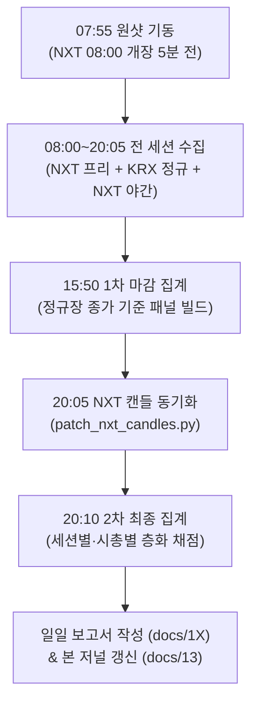

# 연구 일일 분석 기록 및 결과 저널 (Research Daily Journal)

- **목적**: 5거래일(2026-09-16 ~ 2026-09-22) 사전등록 가설 검증 과정에서 매일 적용된 **분석 방법론의 변천**, **데이터 수집 상태**, **당일 단독 결과**, **KRX/NXT 종가 분석**, **누적 가설 채점 추이**를 일자별로 체계적으로 누적 기록합니다.
- **문서 체계**:
  - **일일 상세 감사 보고서**: [`docs/11-research_verification_result_2026-09-16.md`](11-research_verification_result_2026-09-16.md), [`docs/12-research_verification_result_2026-09-17.md`](12-research_verification_result_2026-09-17.md) (체크리스트 C1~C7, J1~J9 전수 검증)
  - **본 저널 ([`docs/13`](13-research_daily_journal.md))**: 일자별 방법론-수집-결과-누적추이-시사점의 통합 다이제스트 및 시계열 트래킹.

---

## 1. 5거래일 누적 가설 검증 트래킹 요약

| 거래일 | 일자 | 정규장 표본수 | 전 축 커버리지 | H1 (흡수) | H2 (외인반대) | H3 (기관동행) | H4 (숨은매집) | H5 (이례도) | 주요 조치 및 방법론 변경 |
|:---:|:---:|:---:|:---:|:---:|:---:|:---:|:---:|:---:|---|
| **1일차** | 2026-09-16 | 1,368봉 | 부분 (C4 결손) | 37건 (74%) | 23건 (76%) | 23건 (80%) | 5건 (60%) | 94건 (47%) | 최초 사전등록 검정, 개미 대조군 문제 제기, C4 프로그램 오전 결손 확인 |
| **2일차** | 2026-09-17 | 1,360봉 | **100.0% 완비** | 32건 (52%) | 18건 (61%) | 12건 (58%) | 8건 (88%) | 149건 (51%) | 원샷 스케줄러(08:50) 도입, KRX/NXT 종가 평가 추가, 시총 층화(대/중) 도입 |
| **2일누적** | **합계** | **2,728봉** | — | **69건 (63%)**<br>[KRX 58% / NXT 70%] | **41건 (71%)**<br>[KRX 56% / NXT 78%] | **35건 (65%)**<br>[KRX 71% / NXT 71%] | **13건 (77%)**<br>[KRX 77% / NXT 46%] | **243건 (50%)**<br>[대형 43% / 중형 64%] | H3 종가 지속성 최고(+46bp), H2 NXT 반등 우수(+55bp), 중형주 H5 되돌림 성립 |
| **3일차** | 2026-09-18 | *(예정)* | *(예정)* | — | — | — | — | — | 08:50 기동 $\rightarrow$ 15:50 post $\rightarrow$ 20:05 NXT 패치 |
| **4일차** | 2026-09-21 | *(예정)* | *(예정)* | — | — | — | — | — | 누적 표본 5,000봉 돌파 예정 |
| **5일차** | 2026-09-22 | *(예정)* | *(예정)* | — | — | — | — | — | 5거래일 최종 가설 승격 심사 |

---

## 2. 일별 상세 기록 (Daily Entries)

### 📅 [2026-09-16] 1일차: 초기 가설 검증 및 데이터 수집 파이프라인 무결성 점검

* **상세 보고서**: [`docs/11-research_verification_result_2026-09-16.md`](11-research_verification_result_2026-09-16.md)
* **표본 범위**: 09:00~15:20 정규장 확정봉 1,368개 (유효 1,359개), 18종목 (대형주 16, 중형주 2)

#### 1) 분석 방법론 (Methodology)
* **평가 프레임워크**: 신호 봉 발생 후 5분봉 기준 장중 6봉(30분), 12봉(60분) 초과수익률(`fwdex6`, `fwdex12`, KOSPI 대비 bp).
* **신호 병합**: 사건 단위(`episodes()`, 동일 종목 연속 신호봉은 첫 봉만 1건으로 집계).
* **대조군 설정**: 유효 봉 전체의 큰손 비율($\ge 0.4$)에 해당하는 상위 분위수(q=0.8553)를 개미 구간에 적용(개미 $R \ge 0.1811$).
* **실행 명령**:
  ```bash
  python3 scripts/research/panel_analyze.py --out local/research/orderbook/2026-09-16 --date 2026-09-16
  python3 scripts/research/ob_analyze.py --out local/research/orderbook/2026-09-16 --date 2026-09-16
  python3 scripts/research/whale_analyze.py --out local/research/orderbook/2026-09-16 --date 2026-09-16
  ```

#### 2) 데이터 수집 및 품질 상태
* **운영 상태**: 장중 수동 기동 (11:25 context/detail, 13:21 market).
* **결손 사항**:
  * **C4 FAIL**: 시장 프로그램(`ka90005`) 09:00~11:41 미수집. 총 332분만 확보되어 연속분 기준 미달.
  * **C3 부분 N/A**: 업종 투자자(`ka10051`) 13:21 시작으로 오전 미수집.
* **정합성**: 가격, 큰손, 종목 투자자 축의 as-of 시계열 결합은 100% 정상.

#### 3) 당일 핵심 분석 결과
* **H1 (큰손 흡수)**: 사건 37건, 6봉 일치율 74% (+15.4bp)로 표면적 성과는 우수.
  * **대조군 함정 발견**: 같은 분위수의 개미 대조군 역시 6봉 일치율 63% (+4.7bp)를 기록하여, "가격이 못 오르고 거래량이 쏠린 봉 뒤의 반등"이 큰손 고유의 선행 매집인지 구조적 반등인지 불분명함.
* **H2 (흡수 + 외국인 매도 반대)**: 사건 23건, 6봉 일치율 76% (+14.8bp).
* **H3 (흡수 + 기관 매수 동행)**: 사건 23건, 6봉 일치율 80% (+18.8bp), 12봉 78% (+25.9bp)로 가장 우수한 지속성.
* **H4 (숨은 매집)**: 사건 5건 (표본 부족으로 보류).
* **H5 (이례도 되돌림)**: 6봉 47% (-1.3bp)로 기준선(55%) 미달.

#### 4) 발견점 및 개선 조치
* 장초 결손(C3, C4)을 원천 차단하기 위해 **08:50 장전 자동 기동 스케줄러** 도입 결정.
* 상시 데몬 대신 1일 통제형 원샷 스케줄러(`start_daily.sh schedule`)를 작성하여 익일(09-17) 예약 완료.

---

### 📅 [2026-09-17] 2일차: 전 축 100% 수집 완주, KRX/NXT 종가 및 시총 층화 분석 도입

* **상세 보고서**: [`docs/12-research_verification_result_2026-09-17.md`](12-research_verification_result_2026-09-17.md)
* **표본 범위**: 09:00~15:20 정규장 확정봉 1,360개 (유효 1,359개), 18종목 (대형주 16, 중형주 2)

#### 1) 분석 방법론 (Methodology 보완)
* **평가 프레임워크 확장**:
  * 장중 6봉/12봉 외에 **당일 KRX 정규장 종가(15:30)** 및 **당일 NXT 야간 종가(20:00)** 초과수익률 지표 추가 (`fwd_krx`, `fwdex_krx`, `fwd_nxt`, `fwdex_nxt`, `nxt_drift_bp`).
  * 장 후반(14:30~15:20) 발생 신호의 종가 귀결 및 오버나이트 성과 측정 체계 구축.
* **시가총액 규모 층화**:
  * `stock_meta.json` 구축: 공식 종목명, 업종, 시가총액, 시총 규모(`size_tier`) 매핑.
  * **대형주 (16종)**: 삼성전자, SK하이닉스, 현대차, 알테오젠, 레인보우로보틱스 등 (시총 5조 이상).
  * **중형주 (2종)**: 두산퓨얼셀 (3.3조), 로보티즈 (4.5조).
* **실행 명령**:
  ```bash
  python3 scripts/research/patch_nxt_candles.py  # 20:00 NXT 캔들 동기화
  python3 scripts/research/panel_analyze.py --out local/research/orderbook/2026-09-17 --date 2026-09-17
  python3 scripts/research/panel_multi.py --root local/research/orderbook --dates 2026-09-16,2026-09-17
  ```

#### 2) 데이터 수집 및 품질 상태
* **운영 상태**: 08:50:15 원샷 기동 $\rightarrow$ 15:45:17 정지 (6시간 55분간 무중단 완주).
* **결손 사항**: **결손율 0.0% 달성**.
  * **C3 PASS**: 업종 투자자 08:50~15:44 414개 스냅샷 완비 (결손 0).
  * **C4 PASS**: 시장 프로그램 08:00~15:44 861분 완비 (정규장 764분 전수 수집, 결손 0).
  * **축 커버리지**: 패널 1,132개 전 봉에서 프로그램·업종·투자자 커버리지 **100.0%**.

#### 3) 당일 핵심 분석 결과 및 신규 발견

##### (a) KRX 정규장 종가 vs NXT 야간 종가 비교 결과 (2026-09-17)
* **18개 전 종목 100% 상승 마감** (하락 0개, 유니버스 평균 **+0.81%, +80.7bp** 상승).
* **NXT 거래량 비중**: KRX 정규장 대비 **평균 9.87%** (삼성전자 140.5만 주 9.35%, SK하이닉스 34.1만 주 9.39%).
* **정규장 과소평가(언더퍼폼) 대형주의 야간 급반등 확인**:
  * 정규장 마감 시점 당일 누적 초과수익(`cum_ex`)이 가장 마이너스로 억눌렸던 종목들이 NXT에서 최대 반등:
    * 삼성전기: 정규장 -237bp $\rightarrow$ **NXT +1.58% (+158bp, 전 종목 1위)**
    * 두산퓨얼셀: 정규장 -153bp $\rightarrow$ **NXT +1.39% (+139bp, 전 종목 2위)**
    * 삼성전자: 정규장 -57bp $\rightarrow$ **NXT +1.39% (+139bp, 전 종목 3위)**
  * 반면 정규장 오버슈팅 종목(한화에어로스페이스 +218bp)은 NXT에서 **+0.18%**로 정체.

##### (b) 2거래일 누적 종합 가설 채점 결과 (누적 2,728봉)
1. **H3 (흡수 + 기관 매수 동행): 정규장 종가까지 지속성 최우수 (+46.3bp)**
   * 6봉 65% $\rightarrow$ 12봉 69% $\rightarrow$ **KRX 종가 71% (+46.3bp)** $\rightarrow$ NXT 종가 71% (+21.0bp).
   * 기관 매수와 큰손 흡수가 결합된 신호는 장 마감(15:30)까지 지속적으로 초과수익이 확대됨.
2. **H2 (흡수 + 외국인 매도 반대): 야간 NXT 세션에서 최대 반등 (+54.7bp)**
   * 외국인 매도 물량을 흡수한 종목은 장중·정규장 종가(56%)에서는 정체되다가, **야간 NXT 종가에서 78% 일치율과 +54.7bp의 강력한 초과수익** 분출.
3. **시총 규모별 핵심 차별화 (H5 이례도 되돌림의 재발견)**:
   * **대형주(16종)**: 큰손 체결 이례도($|z| \ge 1.5$) 발생 후 되돌림 없음 (KRX 종가 43% 미달).
   * **중형주(두산퓨얼셀·로보티즈, 33건)**: 이례도 발생 후 **12봉 74% (+85.4bp), KRX 종가 64% (+53.5bp), NXT 종가 58% (+44.8bp)로 매우 강력한 반대 방향 가격 되돌림 성립**.
   * $\rightarrow$ 유동성이 상대적으로 얇은 중형주에서는 큰손 이상 체결이 과열을 부르고 곧바로 강력한 되돌림으로 이어짐을 실증.

---

## 3. 일별 분석 및 기록 표준 프로토콜 (Operational Protocol)

향후 남은 거래일(09-18, 09-21, 09-22)에 동일하게 적용할 일일 작업 파이프라인입니다.



1. **장 전 (07:55)**: `bash scripts/research/start_daily.sh schedule` 실행 (08:00 NXT 개장 전 07:55 기동, 15:50 post, 20:05 post_nxt 등록).
2. **전 세션 실시간 수집 (08:00~20:05)**:
   * NXT 프리마켓 (08:00~08:50) $\rightarrow$ KRX 정규장 (09:00~15:30) $\rightarrow$ NXT 야간장 (15:30~20:00).
   * `ob_sampler.py`(2종) 및 `market_sampler.py`가 `--until 20:05`로 무중단 전 세션 실시간 스냅샷 수집.
3. **정규장 마감 (15:50)**: `start_daily.sh post` 자동 실행 $\rightarrow$ `global_market_context.json` 수집 및 1차 패널 빌드.
4. **야간 마감 (20:05)**: `start_daily.sh post_nxt` 자동 실행 $\rightarrow$ `patch_nxt_candles.py`로 NXT 캔들 사후 동기화 및 전 세션 최종 재집계.
5. **최종 분석 및 다일 누적 채점 (20:10)**:
   ```bash
   python3 scripts/research/panel_analyze.py --out local/research/orderbook/<DATE> --date <DATE>
   python3 scripts/research/panel_multi.py --root local/research/orderbook --dates 2026-09-16,...,<DATE>
   ```
6. **문서 갱신**:
   * 당일 상세 보고서 `docs/1X-research_verification_result_<DATE>.md` 작성.
   * 본 저널(`docs/13-research_daily_journal.md`)의 요약표 및 일별 엔트리 누적 갱신.

---

> [!NOTE] 3일차 (2026-09-18) 스케줄 예약 현황 (NXT 08:00 개장 반영)
> 2026-09-18 07:16 기준으로 3일차 3단계 원샷 스케줄러 등록 완료:
> - **07:55** (PID 44918): `start_daily.sh start` (NXT 08:00 개장 대비 수집기 3종 가동, `--until 20:05`)
> - **15:50** (PID 44921): `start_daily.sh post` (정규장 마감 1차 집계)
> - **20:05** (PID 44922): `start_daily.sh post_nxt` (NXT 야간 마감 2차 집계)


