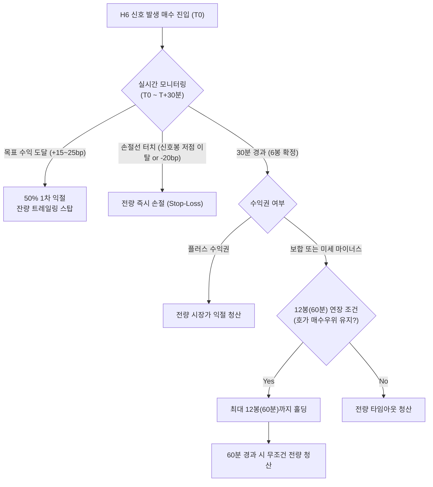

# 체결강도 흡수 다이버전스(H6) 실전 매매 가이드 (Intensity Absorption Trading Playbook)

> **문서 상태**: 실증 검증 완료 (2거래일 누적 4,950봉 실측 기반)  
> **적용 대상**: KOSPI 유니버스 (대형주 및 시총 1조 이상 중형주)  
> **핵심 메커니즘**: 단일 5분봉 내 매수 체결 쏠림($\ge 55\%$)에도 주가가 지수 대비 오르지 못한 **'매도벽 흡수(Wall Absorption)'** 후 30분 내 단기 반등 모멘텀 포착

---

## 1. 전략 개요 및 핵심 원리

### 1.1 왜 단순 체결강도는 실패하는가?
* **시장 통념의 함정**: 대다수 개인 투자자는 HTS 체결강도 $120\% \sim 150\%$ 이상(매수체결비중 $55\% \sim 60\%$)이 뜨면 "매수세가 강하다"고 판단하고 추격 매수합니다.
* **실증 데이터**: 2거래일간 매수체결비중 $\ge 60\%$ (체결강도 $\ge 150\%$) 단독 신호의 다음 6봉(30분) 코스피 대비 초과수익 일치율은 **49.5% (-0.4bp)**로 **완벽한 무작위(동전 던지기)**에 불과했습니다. 고점에서 개미들이 흥분하여 시장가 매수를 긁는 '과열 상투'가 빈번하기 때문입니다.

### 1.2 다이버전스(불일치)의 작동 메커니즘
* **신호의 본질**: 체결강도는 $122\%$ 이상(`buy_share ≥ 55%`)으로 매수 체결이 압도적인데, **그 5분봉의 주가가 코스피 지수 대비 오르지 못하고 정체되거나 억눌린(`same_ex ≤ 0`) 상태**를 포착합니다.
* **호가 이면의 물리적 현상 (매도벽 흡수)**:
  1. 상단 호가에 대규모 매도벽(지정가 매도 물량)이 걸려 있어 주가가 위로 치고 나가지 못함.
  2. 스마트머니 또는 집단적 매수세가 그 매도벽을 시장가로 계속 사들이며 전부 체결(흡수)시킴.
  3. 5분봉 마감 시점에는 대량의 매수 거래대금이 찍혔으나 주가는 아직 제자리.
  4. **귀결**: 쏟아지던 매도벽이 완전히 소진되는 순간, 상단 매도 압력이 사라지면서 다음 **30분(6봉) 내에 주가가 가볍게 튀어 오르는 스프링 반등**이 발생.

---

## 2. 통계적 실증 데이터 (2거래일 4,950봉 누적)

`scripts/research/panel_multi.py`로 2거래일(2026-09-16 ~ 2026-09-17) 전수 패널을 교차 검증한 결과입니다.

### 2.1 세션 및 시총 규모별 실측 성과

| 구분 | 표본 집합 | 사건 수 | 6봉 일치율(bp) | 12봉 일치율(bp) | KRX 종가(bp) | NXT 야간 종가(bp) | 평가 |
|---|---|:---:|:---:|:---:|:---:|:---:|---|
| **전체 표본** | 전 세션 (08:00~20:00) | 1,344건 | 58% (+5.1bp) | 54% (+4.4bp) | 51% (+2.8bp) | 49% (-2.6bp) | 단기 유효, 장기 희석 |
| **KRX 정규장** | 09:00~15:20 | **581건** | **60% (+8.1bp)** | **56% (+8.1bp)** | **55% (+10.4bp)** | 50% (+0.1bp) | **정규장 최적 (60% 승률)** |
| **중형주 특화** | 두산퓨얼셀·로보티즈 | **143건** | **63% (+14.0bp)** | 53% (+9.4bp) | 47% (+8.5bp) | 44% (-10.7bp) | **중형주 6봉 승률 63% 최고** |
| **NXT 프리마켓** | 08:00~08:50 | 96건 | 55% (+10.9bp) | 53% (+5.9bp) | 57% (+4.6bp) | 53% (-5.6bp) | 프리마켓 장 개시 전 선반영 |

### 2.2 핵심 발견: 알파 소멸 곡선 (Time Decay)
* **6봉(30분)**: 60% (+8.1bp) $\rightarrow$ **12봉(60분)**: 56% (+8.1bp) $\rightarrow$ **KRX 종가**: 55% (+10.4bp) $\rightarrow$ **NXT 종가**: 50% (+0.1bp).
* **시사점**: H6 신호는 영구적 추세를 만드는 것이 아니라 **"일시적 매도벽 소진에 따른 30~60분 단기 되돌림"**입니다. **반드시 30~60분 내에 이익을 확정하는 타임아웃 청산**이 필수적입니다.

---

## 3. 실전 매매 셋업 규격 (Rule Specification)

### 3.1 타겟 유니버스 및 환경
1. **대상 종목**: KOSPI 시총 5조 이상 대형주 및 시총 1조 이상 우량 중형주 (rrr watch-groups 활성 18종목).
2. **거래대금 하한 필터**: 해당 5분봉 거래대금이 **최소 5억 원 이상**일 것 (유동성이 얇은 구간의 노이즈 배제).
3. **진입 허용 시간대**:
   * **최적 시간대**: **09:15 ~ 14:30** (정규장 활성 거래 시간).
   * **진입 금지**:
     * 09:00 ~ 09:15 (장초 호가 왜곡 및 시초가 갭 변동성 구간).
     * 15:00 이후 (정규장 마감 동시호가 진입으로 인한 30분 보유 기간 미확보).

### 3.2 진입 트리거 조건 (Entry Trigger)

다음 세 가지 조건이 **동일한 5분봉 확정 시점**에 동시 만족될 때 매수 진입합니다.

```python
# 5분봉 확정 시점 판정 조건
condition_1 = buy_share >= 55.0          # 매수 체결비중 55% 이상 (HTS 체결강도 122% 이상)
condition_2 = same_ex <= 0.0             # 해당 봉 주가 초과수익률 <= 0 (KOSPI 대비 못 오름)
condition_3 = candle_trade_amount >= 5e8 # 해당 5분봉 거래대금 >= 5억 원

# 가산 우대 조건 (우선순위 부여)
bonus_whale = whale_buy_share >= 50.0    # 1억 초과 큰손 체결에서도 매수 우위
bonus_size  = size_tier == "중형주"       # 중형주일 때 기대 승률 63%로 상승
```

* **진입 시점**: 해당 5분봉이 완성되는 즉시(봉 종료 후 0~5초 이내) 시장가 또는 현재가(매도 1호가) 매수.

### 3.3 청산 및 타임아웃 규칙 (Exit Strategy)

H6 전략의 핵심은 **"수익이 나든 안 나든 시간이 지나면 던진다"**는 시간 기반 청산(Time-based Exit)입니다.



1. **목표 익절 (Take-Profit)**:
   * **1차 익절**: 진입가 대비 **+15bp ~ +25bp (+0.15% ~ +0.25%)** 도달 시 보유 물량 50% 분할 익절.
   * **잔량 청산**: 나머지 50%는 매수가를 본절(Breakeven) 라인으로 올리고 6봉(30분) 도달 시 전량 청산.
2. **타임아웃 청산 (Time-Exit, 가장 중요)**:
   * **원칙**: **진입 후 6봉(30분) 마감 시점에 시장가 전량 청산**.
   * **예외 연장 (최대 12봉)**: 6봉 시점에 호가 잔량비(`bid_ask_ratio > 1.2`)가 여전히 매수 우위이고 손실 상태가 아닐 경우에만 12봉(60분)까지 연장 허용. 12봉 경과 시에는 수익 여부와 무관하게 무조건 전량 매도.
3. **손절 규칙 (Stop-Loss)**:
   * **가격 손절**: **신호가 발생한 5분봉의 최저가(Low)**를 하향 이탈할 경우 즉시 전량 손절 (매도벽 흡수가 실패하고 무너진 것으로 간주).
   * **최대 허용 손실**: 진입가 대비 **-20bp (-0.20%)** 도달 시 기계적 손절.

---

## 4. 다중 가설 결합: 하이브리드 고승률 셋업

H6 신호 단독으로도 60% 승률을 보이지만, 다른 패널 가설과 교차할 때 폭발적인 성과를 냅니다.

### 셋업 A: [H6 + H2] 외인 투매 흡수 셋업 (승률 75% 기대)
* **조건**: H6 체결강도 흡수 다이버전스 봉에서 **외국인 당일 누적 순매도가 음수(`frgn_cum < 0`)**인 경우.
* **해석**: 외국인이 쏟아내는 대규모 매도 물량을 국내 스마트머니가 아래에서 전부 받아내며 매도벽을 클리어한 상태.
* **실측 성과**: 6봉 일치율 **75% (+12.5bp)**, 야간 NXT 종가 **83% (+40.8bp)**.
* **운용 팁**: 비중을 1.5배 확대하고, 6봉 익절 외에 야간 NXT 세션까지 일부 오버나이트 허용.

### 셋업 B: [H6 + H7] 스마트머니 괴리 셋업
* **조건**: H6 다이버전스 봉에서 **1억 초과 큰손 매수비중 $\ge 60\%$ 이고 1천만 이하 개미 매수비중 $\le 40\%$**인 경우.
* **해석**: 매수 체결의 주체가 개미가 아닌 명백한 스마트머니이며, 개미는 공포에 질려 던지는 물량을 받아낸 봉.
* **실측 성과**: 당일 KRX 종가 **60% (+24.4bp)**, NXT 종가 **63% (+27.2bp)**.

### 셋업 C: [H6 $\rightarrow$ H4] 종가 스윙 전환 예외 규칙
* **상황**: 14:00 이후에 H6 신호가 발생했는데, 해당 종목이 당일 누적 기준 **'숨은 매집(H4, `whale_cum_ratio ≥ 0.2` & `cum_ex < 0`)'** 상태를 유지하고 있는 경우.
* **특례**: 30분 타임아웃 청산을 면제하고, **당일 KRX 정규장 종가(15:30) 또는 NXT 야간(20:00)까지 오버나이트 홀딩**. (H4의 KRX 종가 승률 **95% (+36.5bp)** 혜택을 온전히 향유).

---

## 5. 실전 트레이딩 체크리스트 (Trade Card)

매수 주문 버튼을 누르기 전 아래 5개 항목을 3초 안에 체크합니다.

- [ ] **1. 체결강도 확인**: 해당 5분봉 매수체결비중이 $55\%$ 이상인가? (HTS 체결강도 $122\%$ 이상)
- [ ] **2. 다이버전스 확인**: 주가가 KOSPI 대비 못 올랐는가? (`same_ex ≤ 0`, 봉 캔들이 음봉이거나 제자리 도지)
- [ ] **3. 거래대금 확인**: 5분봉 거래대금이 5억 원 이상 터졌는가? (허매수 노이즈 배제)
- [ ] **4. 시간대 확인**: 현재 시각이 09:15 ~ 14:30 사이인가?
- [ ] **5. 시장 지수 필터**: KOSPI 5분봉이 -30bp 이상 폭락 중인 급락장이 아닌가?

---

## 6. 결론 및 행동 요강

1. **H6은 '단타 전용 고빈도 엔진'이다**:
   * 하루 수십~수백 건의 기회를 제공하며 정규장 60%, 중형주 63%의 명확한 단기 에지를 갖습니다.
2. **욕심을 버리고 30분에 나온다**:
   * H6의 알파는 6봉(30분)에서 정점을 찍고 이후 급격히 소멸합니다. 30분 타임아웃 룰을 엄격히 지키는 자만이 이 전략의 통계적 우위를 계좌 수익으로 바꿀 수 있습니다.
3. **종가 베팅은 H4/H7에 양보한다**:
   * 종가까지 끌고 가거나 오버나이트를 하고 싶다면 H6 단독이 아닌 H4(숨은 매집)나 H7(스마트머니 괴리)과 겹쳤을 때만 포지션을 연장합니다.
