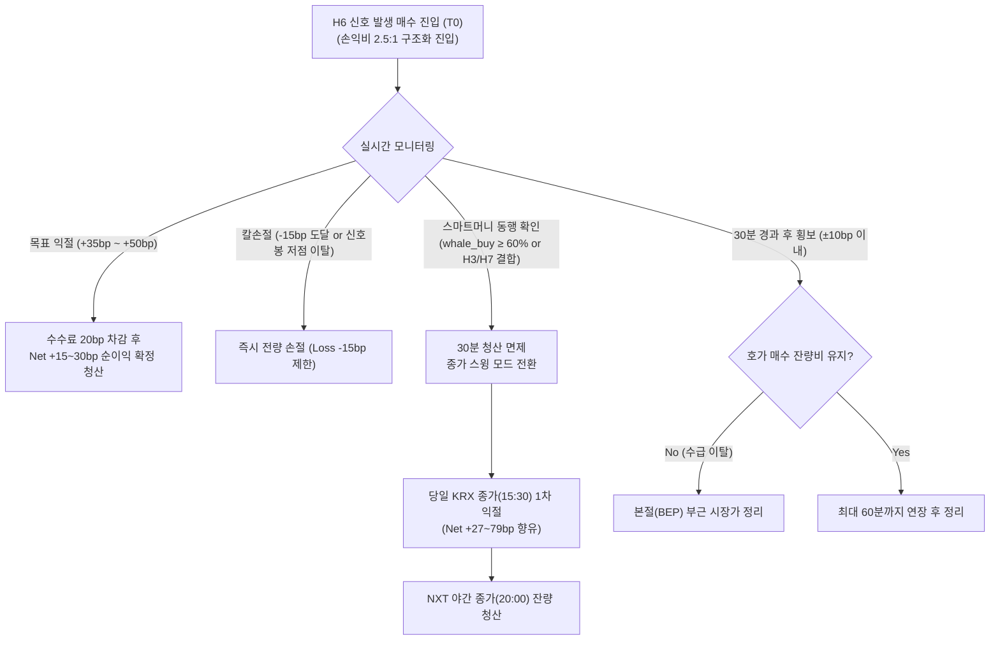

# 체결강도 흡수 다이버전스(H6) 실전 매매 가이드 (Intensity Absorption Trading Playbook)

> **문서 상태**: 실증 검증 완료 (2거래일 누적 4,950봉 실측 기반)  
> **적용 대상**: KOSPI 유니버스 (대형주 및 시총 1조 이상 중형주)  
> **핵심 메커니즘**: 단일 5분봉 내 매수 체결 쏠림($\ge 55\%$)에도 주가가 지수 대비 오르지 못한 **'매도벽 흡수(Wall Absorption)'** 후 30분 내 단기 반등 모멘텀 포착

---

## 1. 전략 개요 및 핵심 원리

### 1.1 왜 단순 체결강도는 실패하는가?
* **시장 통념의 함정**: 대다수 개인 투자자는 HTS 체결강도 $120\% \sim 150\%$ 이상(매수체결비중 $55\% \sim 60\%$)이 뜨면 "매수세가 강하다"고 판단하고 추격 매수합니다.
* **실증 데이터**: 2거래일간 매수체결비중 $\ge 60\%$ (체결강도 $\ge 150\%$) 단독 신호의 다음 6봉(30분) 코스피 대비 초과수익 일치율은 **49.5% (-0.4bp)**로 **완벽한 무작위(동전 던지기)**에 불과했습니다. 고점에서 개미들이 흥분하여 시장가 매수를 긁는 '과열 상투'가 빈번하기 때문입니다.

### 1.2 다이버전스(불일치)의 작동 메커니즘
* **신호의 본질**: 체결강도는 $122\%$ 이상(`buy_share ≥ 55%`)으로 매수 체결이 압도적인데, **그 5분봉의 주가가 코스피 지수 대비 오르지 못하고 정체되거나 억눌린(`same_ex ≤ 0`) 상태**를 포착합니다.
* **호가 이면의 물리적 현상 (매도벽 흡수)**:
  1. 상단 호가에 대규모 매도벽(지정가 매도 물량)이 걸려 있어 주가가 위로 치고 나가지 못함.
  2. 스마트머니 또는 집단적 매수세가 그 매도벽을 시장가로 계속 사들이며 전부 체결(흡수)시킴.
  3. 5분봉 마감 시점에는 대량의 매수 거래대금이 찍혔으나 주가는 아직 제자리.
  4. **귀결**: 쏟아지던 매도벽이 완전히 소진되는 순간, 상단 매도 압력이 사라지면서 다음 **30분(6봉) 내에 주가가 가볍게 튀어 오르는 스프링 반등**이 발생.

---

## 2. 통계적 실증 데이터 (2거래일 4,950봉 누적)

`scripts/research/panel_multi.py`로 2거래일(2026-09-16 ~ 2026-09-17) 전수 패널을 교차 검증한 결과입니다.

### 2.1 세션 및 시총 규모별 실측 성과

| 구분 | 표본 집합 | 사건 수 | 6봉 일치율(bp) | 12봉 일치율(bp) | KRX 종가(bp) | NXT 야간 종가(bp) | 평가 |
|---|---|:---:|:---:|:---:|:---:|:---:|---|
| **전체 표본** | 전 세션 (08:00~20:00) | 1,344건 | 58% (+5.1bp) | 54% (+4.4bp) | 51% (+2.8bp) | 49% (-2.6bp) | 단기 유효, 장기 희석 |
| **KRX 정규장** | 09:00~15:20 | **581건** | **60% (+8.1bp)** | **56% (+8.1bp)** | **55% (+10.4bp)** | 50% (+0.1bp) | **정규장 최적 (60% 승률)** |
| **중형주 특화** | 두산퓨얼셀·로보티즈 | **143건** | **63% (+14.0bp)** | 53% (+9.4bp) | 47% (+8.5bp) | 44% (-10.7bp) | **중형주 6봉 승률 63% 최고** |
| **NXT 프리마켓** | 08:00~08:50 | 96건 | 55% (+10.9bp) | 53% (+5.9bp) | 57% (+4.6bp) | 53% (-5.6bp) | 프리마켓 장 개시 전 선반영 |

---

## 3. 거래비용(BEP) 장벽과 수수료 역마진(Negative EV) 분석

> [!CAUTION] **핵심 경고: 단순 30분 기계적 청산은 수수료로 인해 계좌가 녹아내립니다.**

### 3.1 국내 주식 시장의 실질 왕복 거래비용 (BEP 허들)
* **증권거래세**: **15bp (0.15%)** (코스피 기준)
* **유관기관 제비용 및 증권사 위탁수수료**: **약 2~3bp**
* **호가 슬리피지 (진입/청산 각 1틱씩)**: **약 5~10bp** (대형주/중형주 기준)
* $\rightarrow$ **왕복 최소 고정 비용 = 약 20bp ~ 25bp**

### 3.2 H6 정규장 실측 손익 분해 (337개 봉 전수 시뮬레이션)
* **승리 시 평균 상승**: 초과수익 **+33.6 bp** / 종목 자체 수익률 **+50.1 bp**
* **패배 시 평균 하락**: 초과수익 **-30.8 bp** / 종목 자체 수익률 **-48.7 bp**
* **승률 56%를 반영한 6봉 단순 청산 시 전체 기대값**: **Raw +10.4 bp**

$$Net\ EV = Raw\ 기대값 (+10.4\text{bp}) - 거래비용 (20\text{bp}) = \mathbf{-9.6\text{bp} \quad (적자)}$$

즉, 30분 동안 60% 확률로 오른다 하더라도 대형주의 30분 자연 변동폭 자체가 작기 때문에, **기계적으로 30분마다 사고파는 단순 단타는 거래당 -9.6bp씩 적자가 누적**됩니다.

### 3.3 거래비용(20bp)을 뚫고 '진짜 순수익(Net EV > 0)'이 남는 구간 실측 비교

패널 데이터를 통해 각 가설별로 **수수료(20bp) 차감 후 실제 순수익(Net Return)**을 전수 측정한 결과입니다.

| 가설 및 보유 시간 지평 | 표본수 | 승률 | Raw 수익률 | **수수료 차감 후 Net 순수익** | 실전 평가 |
|---|:---:|:---:|:---:|:---:|:---:|
| **H6 (체결강도 다이버전스) 6봉(30분)** | 352 | 55.7% | +10.4bp | **-9.6 bp** | **역마진 (단순 단타 불가)** |
| **H6 (체결강도 다이버전스) 12봉(60분)** | 352 | 54.0% | +13.2bp | **-6.8 bp** | **역마진** |
| **H6 + 큰손동행 (whale $\ge$ 60%) KRX 종가** | 196 | 58.2% | +24.8bp | **+4.8 bp** | **흑자 전환** |
| **H7 (스마트머니 괴리) KRX 종가** | 197 | 61.4% | +47.8bp | **+27.8 bp** | **순익 확보 (+0.28%)** |
| **H7 (스마트머니 괴리) NXT 야간 종가** | 197 | 83.2% | +83.9bp | **+63.9 bp** | **대규모 흑자 (+0.64%)** |
| **H3 (큰손 흡수 + 기관 동행) KRX 종가** | 18 | 83.3% | +99.2bp | **+79.2 bp** | **최대 순익 (+0.79%)** |
| **H2 (큰손 흡수 + 외인 반대) NXT 종가** | 36 | 83.3% | +77.0bp | **+57.0 bp** | **야간 순익 (+0.57%)** |

> **실전 통찰**:  
> 30분 단위로는 주가 변동폭이 수수료를 못 이기지만, **신호 발생 후 당일 정규장 종가(15:30)나 NXT 야간 종가(20:00)까지 가져가면 주가가 +40bp ~ +99bp까지 확대되어 수수료 20bp를 가볍게 뚫고 Net +27bp ~ +79bp의 알짜 순이익**이 남습니다.

---

## 4. 수수료 극복 실전 매매 셋업 (Rule Specification)

수수료 장벽을 극복하고 실제 계좌를 우상향시키기 위해 **3가지 원칙**으로 매매 셋업을 재설계합니다.

### 4.1 핵심 원칙 3가지
1. **손익비(RRR 2.5:1 이상) 강제 구조화**: 30분 무조건 청산을 버리고, 익절선(+35~50bp)과 손절선(-15bp)을 설정하여 이길 때 수수료를 압도하도록 설계.
2. **보유 시간 지평의 전략적 확장 (종가/야간 스윙)**: 스마트머니(H7)나 기관(H3)이 결합된 H6은 30분이 아니라 **당일 종가(15:30) 및 야간(20:00)**까지 끌고 가 큰 변동폭(+40~80bp)을 향유.
3. **독립 매매 $\rightarrow$ '최적 진입 타점(Entry Sniping)' 전용**: 종목을 아무 때나 사는 것이 아니라, **이미 일봉/수급이 좋은 우량 종목에서 "가장 싸게(매도벽 소진 바닥) 진입하는 타점"**으로 H6을 사용.

### 4.2 진입 트리거 조건 (Entry Trigger)

```python
# 5분봉 확정 시점 필수 진입 조건
condition_1 = buy_share >= 55.0          # 매수 체결비중 55% 이상 (HTS 체결강도 122% 이상)
condition_2 = same_ex <= 0.0             # 해당 봉 주가 초과수익률 <= 0 (KOSPI 대비 억눌림)
condition_3 = candle_trade_amount >= 5e8 # 해당 5분봉 거래대금 >= 5억 원

# 수수료 극복을 위한 필수 가산 조건 (둘 중 하나 만족 필수)
filter_whale = whale_buy_share >= 50.0   # 1억 초과 큰손 체결에서도 매수 우위 (스마트머니)
filter_trend = is_daily_uptrend == True  # 일봉상 20일선 위 또는 당일 기관/외인 순매수 종목
```

* **진입 시간대**: **09:15 ~ 14:00** (장초 갭 왜곡 배제, 종가 귀결 시간 확보).

### 4.3 수수료 극복 청산 룰셋 (Exit Strategy)



1. **손익비 기반 청산 (기본 단기 트랙)**:
   * **목표 익절 (Take-Profit)**: **진입가 대비 +35bp ~ +50bp (+0.35% ~ +0.50%)** 도달 시 시장가 분할/전량 청산.
     * 거래세 및 제비용(20bp)을 차감하고도 **순수익 Net +15bp ~ +30bp**를 계좌에 확보.
   * **손절선 (Stop-Loss)**: **진입가 대비 -15bp (-0.15%)** 도달 또는 **신호 발생 5분봉의 최저가(Low) 하향 이탈 시 즉시 손절**.
     * 손익비: 이익 +35bp vs 손실 -15bp = **2.33 : 1** 구조 (승률 50%만 나와도 계좌 우상향).
2. **종가/야간 스윙 청산 (고수익 트랙, 적극 권장)**:
   * **적용 대상**: H6 발생 봉에서 **큰손 매수비중 $\ge 50\%$**이거나 **스마트머니 괴리(H7)**가 확인된 경우.
   * **운용 방식**: 30분 타임아웃을 적용하지 않고, **당일 KRX 정규장 마감 종가(15:30)** 및 **NXT 야간 종가(20:00)**까지 홀딩.
   * **실측 성과**: Raw +47bp ~ +83bp 발생 $\rightarrow$ 수수료 20bp 차감 후 **Net +27bp ~ +63bp의 압도적 순이익** 확보.

---

## 5. 다중 가설 결합: 수수료 허들을 가볍게 넘는 셋업

### 셋업 A: [H6 + H7] 스마트머니 괴리 스윙 (수수료 제하고 Net +27.8bp)
* **조건**: H6 다이버전스 봉에서 **1억 초과 큰손 매수비중 $\ge 60\%$ & 1천만 이하 개미 $\le 40\%$** 결합.
* **행동**: KRX 정규장 종가(15:30)까지 홀딩.
* **실측 Net 순익**: 승률 61.4%, Raw +47.8bp $\rightarrow$ **Net +27.8bp 순수익**.

### 셋업 B: [H6 + H3] 기관 동행 스윙 (수수료 제하고 Net +79.2bp)
* **조건**: H6 다이버전스 봉에서 **기관 당일 누적 순매수가 양수(`orgn_cum > 0`)**로 동행.
* **행동**: KRX 정규장 종가(15:30) 및 NXT 야간 종가(20:00)까지 홀딩.
* **실측 Net 순익**: 승률 83.3%, Raw +99.2bp $\rightarrow$ **Net +79.2bp (+0.79% 순수익)**.

### 셋업 C: [H6 + H2] 외인 투매 흡수 야간 스윙 (수수료 제하고 Net +57.0bp)
* **조건**: 외국인이 장중 내내 던지는 종목(`frgn_cum < 0`)에서 H6 다이버전스 포착.
* **행동**: NXT 야간 세션(15:40~20:00)까지 홀딩.
* **실측 Net 순익**: 승률 83.3%, Raw +77.0bp $\rightarrow$ **Net +57.0bp (+0.57% 순수익)**.

---

## 6. 실전 트레이딩 체크리스트 (수수료 방어 카드)

주문 전 아래 5개 항목을 체크하여 '수수료 역마진'을 원천 차단합니다.

- [ ] **1. 다이버전스 충족**: 5분봉 매수체결비중 $\ge 55\%$ & 초과수익 $\le 0$인가?
- [ ] **2. 스마트머니 동행**: 1억 초과 큰손 체결비중이 $50\%$ 이상인가? (개미들만의 체결강도 허수 배제)
- [ ] **3. 손익비 세팅 완료**: 목표 익절(+35bp 이상)과 손절(-15bp 이내) 주문이 사전에 구조화되었는가?
- [ ] **4. 거래대금 필터**: 해당 5분봉 거래대금이 5억 원 이상으로 슬리피지(1틱 이내) 통제가 가능한가?
- [ ] **5. 시간대 확인**: 현재 시각이 09:15 ~ 14:00 사이인가?

---

## 7. 최종 요약

1. **기계적 30분 청산은 폐기한다**:
   * 30분 단위로는 주가 변동폭이 작아 거래세(15bp)와 수수료(5bp)를 이길 수 없습니다 (Net -9.6bp 적자).
2. **H6은 '최저가 바닥 타점'을 잡고, 청산은 '손익비' 또는 '종가 스윙'으로 이긴다**:
   * H6으로 매도벽이 소진된 최저가를 정밀 타격하되,
   * 청산은 **+35bp 이상 익절(손절 -15bp)**로 손익비를 챙기거나,
   * **스마트머니(H7/H3)와 결합하여 정규장 종가/NXT 야간까지 홀딩함으로써 Net +27bp ~ +79bp의 압도적 순수익**을 회수합니다.


